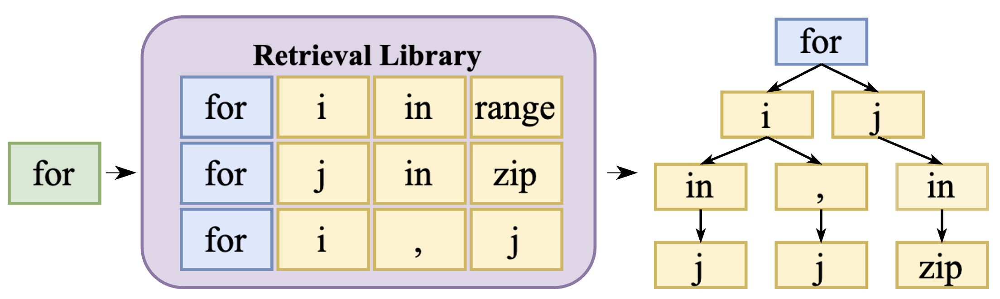
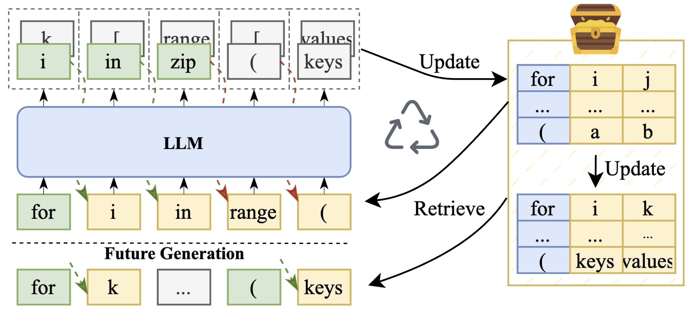
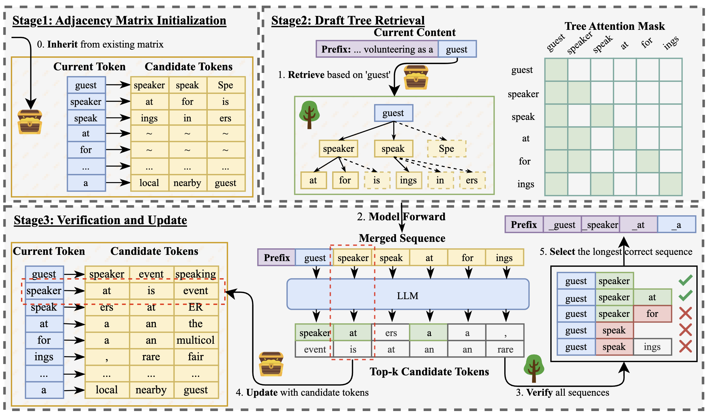
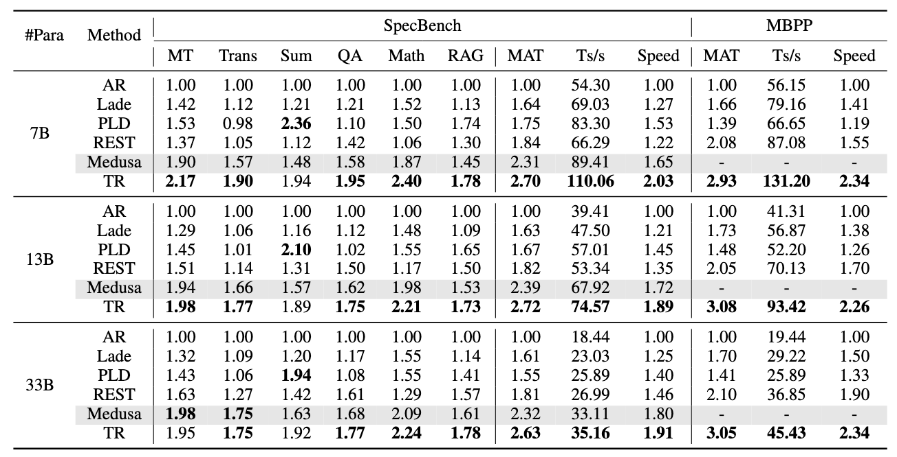
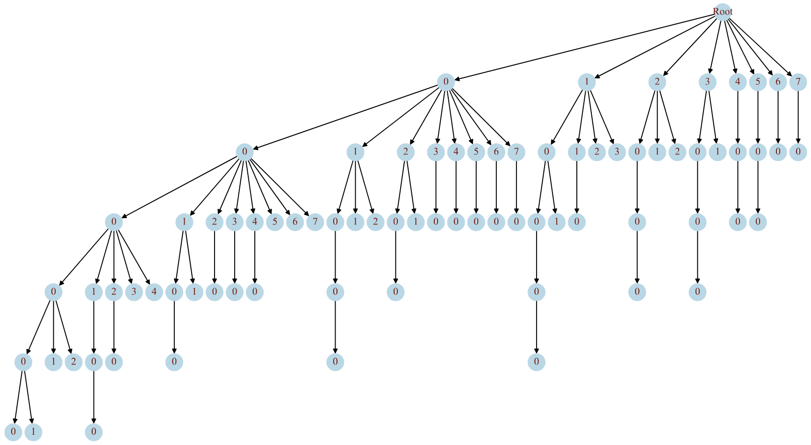

<div align="center"><h1>&nbsp;Turning Trash into Treasure: Accelerating Inference of Large Language Models with Token Recycling</h1></div>

<p align="center">
| <a href="https://arxiv.org/abs/2408.08696"><b>Paper</b></a> | <a href=""><b>Slide</b></a> | <a href=""><b>Poster</b></a> | <a href=""><b>Video</b></a> | 
</p>

---
*News* 🔥
- [2025/5] Token Recycling is accepted by ACL2025!

---

## Contents
- [Contents](#contents)
- [Introduction](#introduction)
  - [Background: Retrieval-Based Speculative Decoding](#background-retrieval-based-speculative-decoding)
  - [Token Recycling: Turning Trash into Treasure! 🔄](#token-recycling-turning-trash-into-treasure-)
  - [Experimental Results 📊](#experimental-results-)
- [Usage](#usage)
  - [Install](#install)
  - [Project Structure](#project-structure)
  - [Inference](#inference)
    - [Quick Start](#quick-start)
    - [Advanced Usage](#advanced-usage)
    - [Candidate Storage Configuration 🛠️](#candidate-storage-configuration-️)
    - [Tree Structure Configuration 🌳](#tree-structure-configuration-)
- [Todo](#todo)
- [Citation](#citation)


## Introduction 
We introduce Token Recycling:
- A plug-and-play speculative decoding method to accelerate LLM inference~
- Only requires minimal storage space **(<2MB)**, without the need for a draft model or a data store!
- Achieves approximately **2x** speedup on all sizes of LLMs!

### Background: Retrieval-Based Speculative Decoding

Traditional speculative decoding methods face significant limitations:
- **Model-based** require training and maintaining additional models, increasing complexity and computational overhead.
- **Retrieval-based** need large-scale stores, time-consuming retrieval or suffer from a retrieval space that lacks flexibility and adaptability.

<center>
  
</center>


### Token Recycling: Turning Trash into Treasure! 🔄

LLMs generate a probability distribution over the vocabulary at each step, yet existing methods keep only the sampled token, treating all others as '**trash**'. We observe that these other high-probability candidate tokens frequently appear in subsequent generations, making them a valuable but overlooked '**treasure**'.

<center>
  
</center>

Based on the oberservation, we propose Token Recycling (TR). It utilizes an adjacency matrix to store candidate tokens for every token in the vocabulary. In each generation step, a Breadth-First Search (BFS) if performed on this matrix, starting from the last token of current input, to generate a draft tree. 
After model forward the tree attention and verification, the newly generated candidate tokens are used to update the adjacency matrix. 
In this way, 'trash' tokens are turned into a 'treasure'! 



### Experimental Results 📊



On SpecBench, TR achieves more than a 2x speedup on the 7B model, nearly 30% higher than the previous train-free methods. Even compared to tuning Medusa, it shows an improvement of almost 25%. For the 13B and 33B models,it consistently provides nearly 2x speedup, maintaining the 30% acceleration advantage.

| Method | Memory (MB) | Tokens/s | Speed |
|:---|---:|---:|---:|
| Eagle1 | 500 | 106.94 | 2.08 |
| Eagle2 | 500 | **116.95** | **2.28** |
| TR | **1.95** | 107.52 | 2.09 |


TR is also compared with the SOTA speculative decoding methods - [Eagle1/2](https://github.com/SafeAILab/EAGLE) on SpecBench. It is a surprise that, despite being completely training-free and self-drafting, TR outperforms Eagle1. Moreover, TR achieves 91.23% of the acceleration performance of Eagle2 while only requiring 0.39% of the memory used by Eagle2. It is worth noting that TR still employs a static tree, rather than the dynamic tree used in Eagle2. This highlights the remarkable effectiveness and efficiency of TR and shows potential for further improvement when combine TR with dynamic trees.


## Usage

### Install
This codebase is built on the [SpecBench](https://github.com/hemingkx/Spec-Bench), no other package are needed excepted for those used by Spec-Bench.

```bash
git clone https://github.com/Luowaterbi/TokenRecycling.git
cd TokenRecycling
pip install -r requirements.txt
```

**Note**: Make sure you have the required models downloaded. The evaluation script expects models in `../models/` directory relative to the project root.

### Project Structure

```
TokenRecycling/
├── README.md                    # Project documentation
├── requirements.txt             # Python dependencies
├── eval.sh                      # Quick evaluation script
├── data/                        # Dataset files
├── evaluation/
│   ├── inference_recycling.py  # Main inference implementation
│   └── eval.py                  # Evaluation utilities
└── model/
    └── recycling/
        ├── tree_template_.py   # Tree structure definitions
        ├── kv_cache.py         # Key-value cache management
        └── modeling_llama_kv.py # LLaMA model modifications
```
### Inference

#### Quick Start
```bash
bash eval.sh
```

#### Advanced Usage

You can customize the inference parameters:

```bash
python -m evaluation.inference_recycling \
    --model-path /path/to/your/model \
    --model-id your-model-id \
    --bench-name spec_bench \
    --dtype float16 \
    --output-id-topk 8 \
    --tree-version "2.2.2" \
    --temperature 0.0
```

#### Candidate Storage Configuration 🛠️

You can customize the number of candidate tokens stored for each token in the vocabulary using the `--output-id-topk` argument. This parameter controls how many high-probability "treasure" tokens are collected from the output distribution to build and update the adjacency matrix. 

For implementation details, you can refer to [`evaluation/inference_recycling.py`](evaluation/inference_recycling.py#L232).

#### Tree Structure Configuration 🌳

Token Recycling uses a **fixed tree template** ([version "2.2.2"](./model/recycling/tree_template_.py) by default) to organize candidate tokens in a tree structure.



**Tree Representation:**
- **Root**: Represents the current input's last token.
- **Index Meaning**: Numbers on the tree represent the node's index position in its parent's candidate list (0-7 for top-k=8).
```
Root (current input's last token.)
├── [0] → 0th candidate token
│   ├── [0,0] → 0th candidate after [0]
│   │   └── [0,0,0] → 0th candidate after [0,0]
│   └── [0,1] → 1st candidate after [0]
├── [1] → 1st candidate token
│   └── [1,0] → 0th candidate after [1]
└── [2] → 2nd candidate token
```

**Tree Template Implementation:**
The tree structure is defined in [`model/recycling/tree_template_.py`](./model/recycling/tree_template_.py). 
- Each node is represented by a path from root: `[depth_0_index, depth_1_index, ...]`
  - `[0]`: The 0th child of root
  - `[0,1]`: The 1st child of root's 0th child
  - `[0,1,2]`: The 2nd child of the node at path `[0,1]`
- The current default template "2.2.2" has 80 nodes (except root) organized in 6 levels:
  - **Level 1**: 8 nodes `[0], [1], ..., [7]`
  - **Level 2**: 21 nodes like `[0,0], [0,1], ..., [7,0]`
  - **Level 3**: 25 nodes like `[0,0,0], [0,0,1], ..., [5,0,0]`
  - **Level 4**: 15 nodes like `[0,0,0,0], [0,0,0,1], ..., [3,0,0,0]`
  - **Level 5**: 8 nodes like `[0,0,0,0,0], [0,0,0,0,1], ..., [1,0,0,0,0]`
  - **Level 6**: 3 nodes `[0,0,0,0,0,0], [0,0,0,0,0,1], [0,0,0,1,0,0]`
  - Path `[0,1,2]` means: "From root, take the 0th candidate, then from that token take the 1st candidate, then from that token take the 2nd candidate"


**How to Customize Tree Structure:**

1. **Add new tree version** with different branching factors:
   ```python
   if version == "mine":
       # More candidates at each level
       tree_template = [
           [0], [1], [2], [3], [4],     # 5 candidates at depth 1
           [0,0], [0,1], [1,0], [1,1],  # 4 candidates at depth 2
           # ... continue pattern
       ]
   ```

2. **Use your custom tree**:
   ```bash
   python -m evaluation.inference_recycling \
       --tree-version "mine" \
       # ... other parameters
   ```

## Todo

We are actively working to expand Token Recycling's compatibility and ease of use. Contributions are welcome!

- [ ] Adapt to newer models (currently based on Vicuna-1.3)
- [ ] Transformers `model.generate()` support
- [ ] vLLM & SGLang integration

**Seek for help**: If you have experience with integration and would like to contribute, please contact us! Your help would be greatly appreciated! 🙏

## Citation
```bibtex
@article{luo2024turning,
  title={Turning trash into treasure: Accelerating inference of large language models with token recycling},
  author={Luo, Xianzhen and Wang, Yixuan and Zhu, Qingfu and Zhang, Zhiming and Zhang, Xuanyu and Yang, Qing and Xu, Dongliang},
  journal={arXiv preprint arXiv:2408.08696},
  year={2024}
}
```

